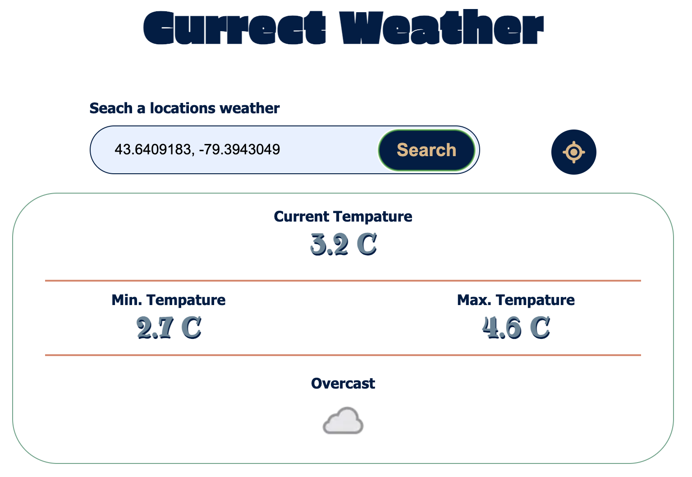

# Weather App

This weather application is created in three different technologies. The application will allow the user either use thier current location or enter in a location they would like to know the currect weather. The applicaiton will then send the information via a node server to [weaterAPI](https://www.weatherapi.com/docs/) which will then return the location's currect weather information.

- JS-WeatherApp: created with vanilla javascript
- React-WeatherApp: created with react and used a node server to retrieve data from the api
- Vue-WeatherApp: created using vue and used the same node server as the react app to retrieve data from the api.
- WeatherAppServer: created using node and express to retrieve weather data from [weaterAPI](https://www.weatherapi.com/docs/). Both the react and and vue application use the node server.

